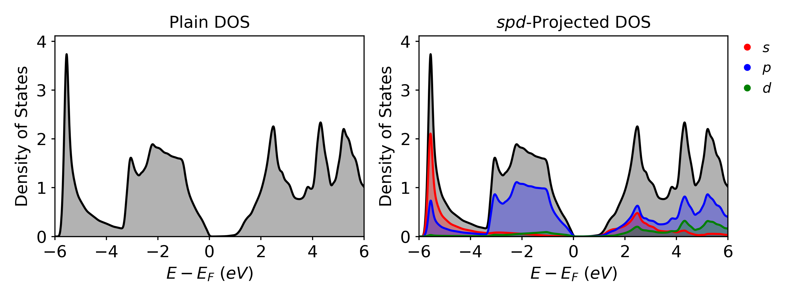
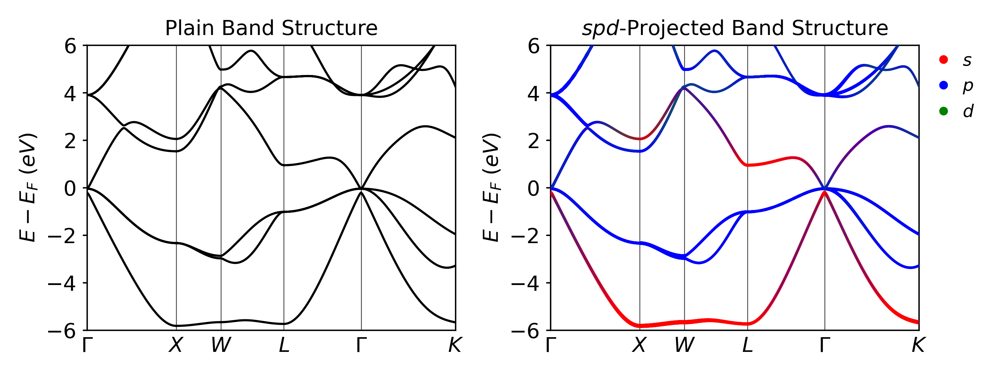

# Bulk InAs (PBE)
In this step we will run our first calculation on bulk InAs

## Folder Layout
- `basic_training`
	- `InAs_bulk`
		- `pbe`
			- `scf`
			- `band`
			- `dos`

## Basic Steps
1. Run the SCF Calculations in the `scf` folder.
2. Copy the CHG and CHGCAR files to the `band` and `dos` folders.
3. Run the Band and DOS calculations.
4. Plot the data.

## Global Files
The POSCAR and POTCAR will be the same for the SCF, DOS, and Band calculations.

### POSCAR
The POSCAR for the bulk InAs is given below

```txt
In1 As1  
1.0  
0.000000 3.029200 3.029200  
3.029200 0.000000 3.029200  
3.029200 3.029200 0.000000  
In As  
1 1  
direct  
0.000000 0.000000 0.000000 In  
0.250000 0.250000 0.250000 As
```

### POTCAR
The POTCAR can be easily generated using the potcar.sh script included in the basic training files.

```bash
potcar.sh In As
```

To double check the elements in the POTCAR you can run the following command

```bash
grep 'TITEL' POTCAR
```

The output will be the following

```txt
TITEL = PAW_PBE In 08Apr2002  
TITEL = PAW_PBE As 22Sep2009
```

## Automation
This entire calculation can be automated using a simple python script included below:
```python
from os.path import isdir, join
import os
import shutil

dirs = ["scf", "dos", "band"]
base_dir = os.getcwd()

for d in dirs:
    print(d)

    if not isdir(d):
        os.mkdir(d)

    shutil.copy("POSCAR", join(d, "POSCAR"))

    os.chdir(d)
    os.system(f"incar.py --{d} --kpar 8 --ncore 8")
    os.system("potcar.sh In As")

    if d == "scf":
        os.system("kpoints.py -g -d 7 7 7")
    elif d == "dos":
        os.system("kpoints.py -g -d 15 15 15")
    elif d == "band":
        os.system("kpoints.py -b -c GXWLGK")

    os.chdir(base_dir)
```

And it can be submitted to the cluster using the following script.

```bash
#!/bin/bash -l
#SBATCH -J pbe # Job name
#SBATCH -N 1  # Number of nodes
#SBATCH -o stdout # File to which STDOUT will be written %j is the job #
#SBATCH -t 30
#SBATCH -q debug
#SBATCH -A m3578
#SBATCH --constraint=knl
export OMP_NUM_THREADS=1
module load vasp/5.4.4-knl

cd scf
srun -n 64 -c 4 --cpu_bind=cores vasp_ncl > vasp.out

fermi_str=$(grep 'E-fermi' OUTCAR)  
fermi_array=($fermi_str)  
efermi=${fermi_array[2]}  
emin=`echo $efermi - 7 | bc -l`  
emax=`echo $efermi + 7 | bc -l`  
sed -i "s/EMIN = emin/EMIN = $emin/" ../dos/INCAR  
sed -i "s/EMAX = emax/EMAX = $emax/" ../dos/INCAR

cp CHG* ../band
cp CHG* ../dos

cd ../band
srun -n 64 -c 4 --cpu_bind=cores vasp_ncl > vasp.out

cd ../dos
srun -n 64 -c 4 --cpu_bind=cores vasp_ncl > vasp.out
```

## SCF Calculation
The first step in any calculation is to perform the SCF calculation. In this section, the process to set up the input files will be shown. For a more detailed breakdown of the SCF calculation see [[Step 3 - Calculation Descriptions]].

### INCAR
As shown in section [[Step 3 - Calculation Descriptions]] the INCAR for an SCF calculation can be generated using the incar.py file.

```bash
incar.py --scf
or
incar.py -s
```

This results in the following file.

```txt
# general
ALGO = Fast     # Mixture of Davidson and RMM-DIIS algos
PREC = N        # Normal precision
EDIFF = 1e-5    # Convergence criteria for electronic converge
NELM = 500      # Max number of electronic steps
ENCUT = 400     # Cut off energy
LASPH = True    # Include non-spherical contributions from gradient corrections
NBANDS = 5    # Number of bands to include in the calculation
BMIX = 3        # Mixing parameter for convergence
AMIN = 0.01     # Mixing parameter for convergence
SIGMA = 0.05    # Width of smearing in eV

# parallelization
KPAR = 8        # The number of k-points to be treated in parallel
NCORE = 8        # The number of bands to be treated in parallel

# scf
ICHARG = 2      # Generate CHG* from a superposition of atomic charge densities
ISMEAR = 0      # Fermi smearing
LCHARG = True   # Write the CHG* files
LWAVE = False   # Does not write the WAVECAR
LREAL = Auto    # Automatically chooses real/reciprocal space for projections
```

## Density of States Calculation
After the SCF calculation is finished, the CHG and CHGCAR files can be copied to the folder with the DOS calculation files. For a more detailed breakdown of the DOS calculation see section [[Step 3 - Calculation Descriptions]].

### INCAR
The INCAR for a DOS calculation can be generated using the incar.py file.

```bash
incar.py --dos
or
incar.py -d
```

Which results in the following file. The values of EMIN and EMAX were automatically  determined using the code shown in section [[Step 3 - Calculation Descriptions]].

```txt
# general 
ALGO = Fast     # Mixture of Davidson and RMM-DIIS algos
PREC = N        # Normal precision
EDIFF = 1e-5    # Convergence criteria for electronic converge
NELM = 500      # Max number of electronic steps
ENCUT = 400     # Cut off energy
LASPH = True    # Include non-spherical contributions from gradient corrections
NBANDS = 12    # Number of bands to include in the calculation
BMIX = 3        # Mixing parameter for convergence
AMIN = 0.01     # Mixing parameter for convergence 
SIGMA = 0.05    # Width of smearing in eV

# parallelization
KPAR = 8        # The number of k-points to be treated in parallel
NCORE = 8        # The number of bands to be treated in parallel

# dos 
ICHARG = 11     # Calculate eigenvalues from preconverged CHGCAR
ISMEAR = -5     # Tetrahedron method with Blochl corrections
LCHARG = False  # Does not write the CHG* files
LWAVE = False   # Does not write the WAVECAR files 
LORBIT = 11     # Projected data (lm-decomposed PROCAR)
NEDOS = 3001    # 3001 points are sampled for the DOS
EMIN = -3.7174     # Minimum energy for the DOS plot
EMAX = 10.2826     # Maximum energy for the DOS plot
```

### KPOINTS
For a DOS calculation we would like to have a denser kpoint mesh to get more accurate results. The code to generate the KPOINTS file is shown below.

```bash
kpoints.py --grid --density 15 15 15
or
kpoints.py -g -d 15 15 15
```

### Results
Once the calculation is completed, VaspVis can be used to visualize the density of states plots. The following code shows how to easily generate two DOS plots which will be saved as `dos_plain.png` and `dos_spd.png` which are shown below



## Band Structure Calculation
After the SCF calculation is finished, the CHG and CHGCAR files can be copied to the folder with the Band calculation files. For a more detailed breakdown of the Band calculation see section [[Step 3 - Calculation Descriptions]].

### INCAR
The INCAR for a band structure calculation can be generated using the incar.py file.

```bash
incar.py --band
or
incar.py -b
```

Which results in the following file:

```txt
# general 
ALGO = Fast     # Mixture of Davidson and RMM-DIIS algos
PREC = N        # Normal precision
EDIFF = 1e-5    # Convergence criteria for electronic converge
NELM = 500      # Max number of electronic steps
ENCUT = 400     # Cut off energy
LASPH = True    # Include non-spherical contributions from gradient corrections
NBANDS = 12    # Number of bands to include in the calculation
BMIX = 3        # Mixing parameter for convergence
AMIN = 0.01     # Mixing parameter for convergence 
SIGMA = 0.05    # Width of smearing in eV

# parallelization
KPAR = 8        # The number of k-points to be treated in parallel
NCORE = 8        # The number of bands to be treated in parallel

# band 
ICHARG = 11     # Calculate eigenvalues from preconverged CHGCAR
ISMEAR = 0      # Fermi smearing
LCHARG = False  # Does not write the CHG* files
LWAVE = False   # Does not write the WAVECAR files (True for unfolding)
LORBIT = 11     # Projected data (lm-decomposed PROCAR)
```

### KPOINTS
For a band structure calculation, the KPOINTS file is the most important input because it determines the path of your band structure. Usually we find the path from literature or helpful tools such as <a href="https://www.materialscloud.org/work/tools/seekpath" target="_blank">SeeK-path</a>. For our zinc-blende structures such as InAs we choose the k-path $\Gamma-X-W-L-\Gamma-K$, which can be generated using the following code with `kpoints.py`.

```bash
kpoints.py --band --coords GXWLGK
or
kpoints.py -b -c GXWLGK
```

The resulting KPOINTS file will look like this:

```txt
Line_mode KPOINTS file
50
Line_mode
Reciprocal
0.0 0.0 0.0 ! G
0.5 0.0 0.5 ! X

0.5 0.0 0.5 ! X
0.5 0.25 0.75 ! W

0.5 0.25 0.75 ! W
0.5 0.5 0.5 ! L

0.5 0.5 0.5 ! L
0.0 0.0 0.0 ! G

0.0 0.0 0.0 ! G
0.375 0.375 0.75 ! K
```

### Results
Once the calculation is completed, VaspVis can be used to visualize the band structure plots. The following code shows how to easily generate two band structure plots which will be saved as `band_plain.png` and `band_spd.png` which are shown below:

